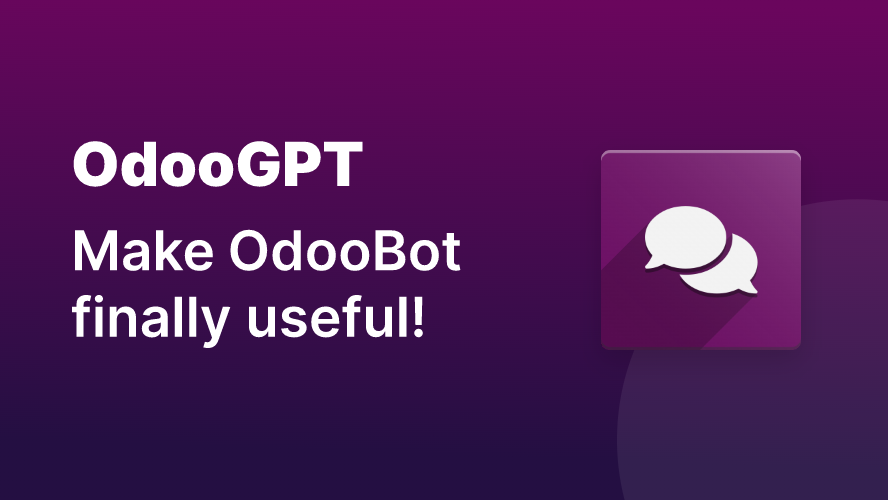

# odoogpt




Make OdooBot finally useful


## Requirements

The module requires the OpenAI python library named `openai` and Odoo 16.0.


## Installation instructions 

1. Place all downloaded **modules** into your Odoo's addons folder

2. Install required **python modules**:

```
pip install openai
```

3. Go to **"Apps"** (in debug mode) and click **"Update Apps List"**. Accept at confirmation.

4. Search for "odoogpt" in Apps list and install it by pressing "Activate" button. 


## Configuration

### Base config

1. Go to **"Settings → OdooGPT"** and fill your OpenAI Api token. Get it from there: https://beta.openai.com/account/api-keys

2. Save configurations

3. Click "Test" near the api token. If message "Everything properly set up! You're good to go!" appears, the configuration is done. 

4. If needed, play with the **"OpenAI Parameters"**. To understand how they work, refer to OpenAi official docs at https://beta.openai.com/docs 

> NOTE: by default, the system will use the model "text-davinci-003". You can change it in settings


### OdooBot / Chat config

1. Go to **"Settings → OdooGPT"** and look at "OdooGPT Chat Customization"

2. If needed, customize the "Prompt prefix" and "Prompt suffix"

3. Save settings and enjoy!


## Thanks to

Icons generated with https://spilymp.github.io/ibo

- Odoo Version: Odoo 15
- Icon Set: Font Awesome 5
- Icon Background Color: #701068